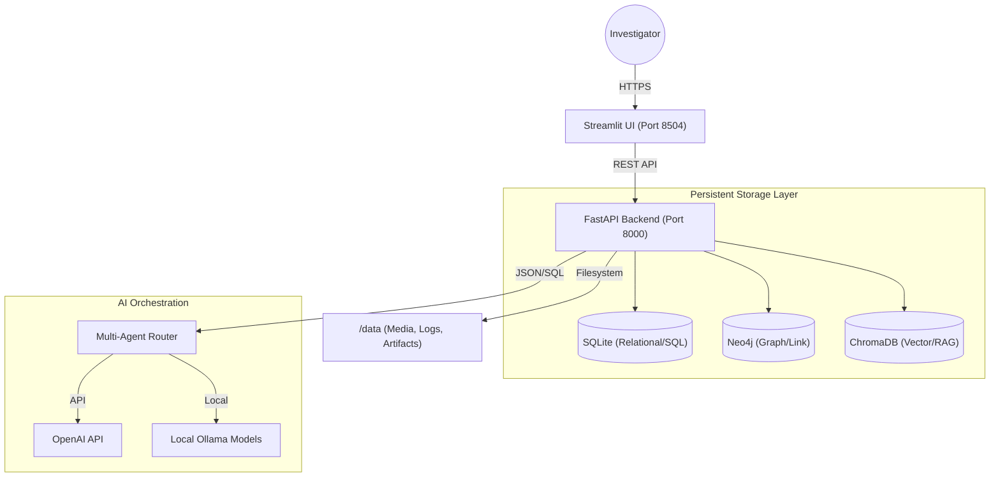

# 01. Infrastructure Design

The **Sentinel Fraud AI Workbench** is built on a microservices-inspired architecture, containerized for rapid deployment and environment parity.

## 🏗️ Architecture Overview

The system uses a **Dual-Process/Triple-Storage** model:
- **Frontend**: Streamlit-based investigative UI.
- **Backend**: FastAPI microservices for LLM orchestration and data processing.
- **Storage**: Polyglot persistence across Relational, Graph, and Vector stores.

## 🌐 Networking & Service Mesh

- **Docker Bridge Network**: Services communicate via internal DNS (e.g., `fastapi`, `fraud_neo4j`) within the `fraud_network`.
- **Port Masking**: Only the Streamlit UI (8504) and FastAPI (8000) ports are exposed to the host machine by default for security.
- **Neo4j Access**: Neo4j's UI (7474) and Bolt protocol (7687) are mapped to facilitate direct graph inspection by developers.

## 💾 Storage Components

| Component | Technology | Purpose |
| :--- | :--- | :--- |
| **Relational DB** | SQLite | Transaction logs, user sessions, role permissions. |
| **Graph Store** | Neo4j | Fraud ring mapping, entity link analysis. |
| **Vector Index** | ChromaDB | Semantics of financial documents and investigation notes. |
| **Media Store** | Filesystem | Persistent storage of audio/video evidence and PDF reports. |

## 🐳 Containerization Strategy

The project uses multi-stage builds to optimize image sizes:
- **python:3.10-slim**: Base image for streamlit and fastapi.
- **neo4j:5.11.0**: Official image with `apoc` and `gds` (Graph Data Science) plugins enabled for advanced fraud detection algorithms.
