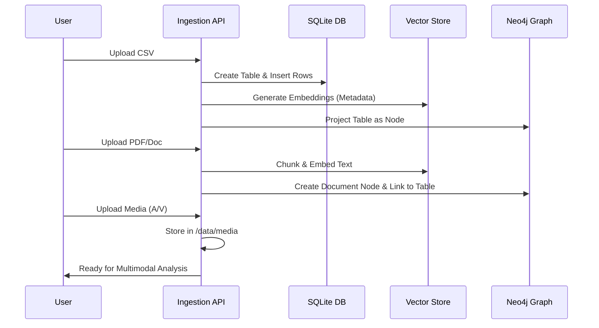

# 02. Data Flow Architecture

Sentinel employs a complex data lifecycle that transforms raw, unorganized inputs into structured, searchable intelligence.

## 🔄 1. The Ingestion Pipeline

Data enters the system via the `Data Hub`. The pipeline differs based on the input type:

## 🧠 2. Query Flow (The RAG Loop)

The "Retrieval-Augmented Generation" flow ensures the LLM has grounded context before answering questions.

1.  **Semantic Retrieval**: The system queries the Vector Store for relevant document segments.
2.  **Schema Retrieval**: The query engine looks up the SQL schema for structural grounding.
3.  **Context Assembly**: A "Combined prompt" is built containing the user question, relevant data snippets, and schema hints.
4.  **Generative Response**: The LLM processes the unified context to produce an accurate, grounded answer.

## 🕸️ 3. Graph Projection Flow

To surface fraud rings, data must be synced between the relational storage and the graph network:
- **Sync Trigger**: Admin manually triggers "Project Data to Graph".
- **Entity Resolution**: The system identifies unique IDs (Emails, IPs, Account IDs) and creates **Nodes**.
- **Edge Creation**: Transactions are converted into **RELATIONSHIPS** (e.g., `(User)-[:SENT]->(Transaction)-[:RECEIVED_BY]->(User)`).

## 📄 4. Export & Audit Flow

Every major analysis creates a permanent record:
- **Synthesis Agent**: Generates a Final Report.
- **PDF Generator**: Converts the synthesis, raw SQL, and data tables into a hardened PDF.
- **Audit Logger**: Records the user action, timestamp, and query parameters for forensic review.
