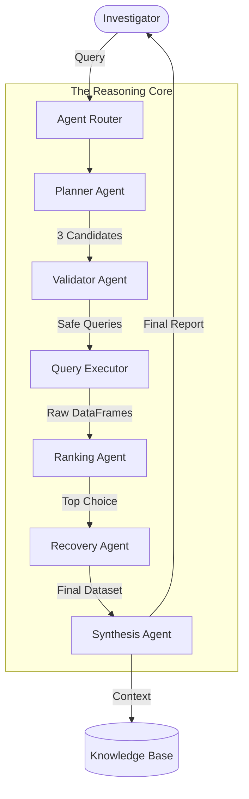

# 03. Multi-Agent Intelligence System

Sentinel uses a sophisticated multi-agent orchestration pattern to ensure accuracy, safety, and depth in fraud investigations. Instead of a single "black box" prompt, tasks are broken down and assigned to specialized agents.

## 🧠 1. Agent Roles & Responsibilities

| Agent | Responsibility | Primary Tooling |
| :--- | :--- | :--- |
| **Planner Agent** | Decomposes the user query and generates multiple SQL/Cypher candidates. | LLM Reasoning |
| **Validator Agent** | Inspects generated code for security risks (SQL injection) and syntax correctness. | Pydantic / Static Analysis |
| **Ranking Agent** | Executes candidates and scores results based on data density and relevance. | python-sql-parser / Pandas |
| **Recovery Agent** | Automatically repairs failed queries using error tracebacks. | LLM Repair Loops |
| **Synthesis Agent** | Combines raw data with domain knowledge from the knowledge base to form an opinion. | RAG Knowledge Base |

## 🤝 2. Collaborative Workflow (The SQL RAG Example)

The following diagram illustrates the "Agentic Loop" used when an investigator asks a natural language question about transaction data:

## 🔄 3. Orchestration Logic

- **Parallel Execution**: SQL candidates are executed in parallel to minimize latency.
- **Fail-Safe Cascade**: If all 3 SQL candidates fail, the system falls back to a "Broad Search" agent that attempts to find related tables instead of specific rows.
- **Self-Repair Logic**: The Recovery Agent is triggered by Python exceptions. It feeds the error message back to the LLM with a "Fix this SQL" prompt, allowing for up to 2 retry attempts.

## 🛡️ 4. Security & Isolation

- **Read-Only Enforcement**: The system strictly enforces `SELECT` operations for agents. Any `DROP`, `DELETE`, or `UPDATE` commands are caught by the **Sentinel Guard** middleware before execution.
- **Token Budgeting**: Agent reasoning traces are capped to prevent "hallucination loops" that could consume excessive compute tokens.
