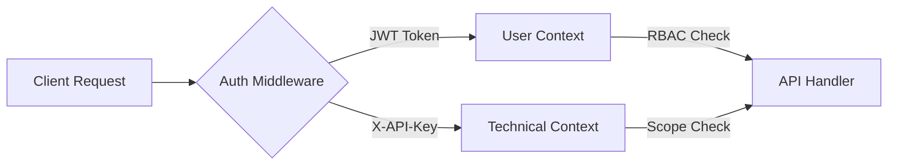

# 05. API & Service Integration

Sentinel's backend is powered by **FastAPI**, providing a high-performance, asynchronous interface for both the UI and external technical consumers.

## 🔌 1. API Contract Design

The API follows a strict **Pydantic Model** contract system to ensure data integrity across microservices.

### Key Endpoints:
- **`/auth/token`**: OAuth2 with Password Flow (JWT generation).
- **`/ingest/file`**: Multipart/form-data endpoint for multimodal evidence ingestion.
- **`/agents/query`**: The primary gateway for the multi-agent RAG pipeline.
- **`/models/score`**: Real-time inference endpoint for custom fraud models.

## 🔐 2. Security & Authentication Layer

Sentinel implements a **Dual-Layer Authentication** strategy managed in `api/dependencies.py`:

- **User Access**: JWT tokens issued during login are passed in the `Authorization: Bearer <token>` header.
- **Technical Access**: Persistent keys used by cron jobs or CLI tools are passed via `X-API-Key`.
- **Role Elevation**: Dependencies like `requires_admin` wrap protected routes to ensure functional authorization.

## 🌐 3. External Integrations

- **LLM Providers**: Pluggable architecture supporting OpenAI, DeepSeek, and Local Ollama via the `agents/llm_router.py`.
- **HuggingFace**: Used locally for vector embedding generation when cloud-latency is a concern.
- **Notification Webhooks**: (Planned) Integration for pushing alerts to Slack or Microsoft Teams when high-risk anomalies are detected.
