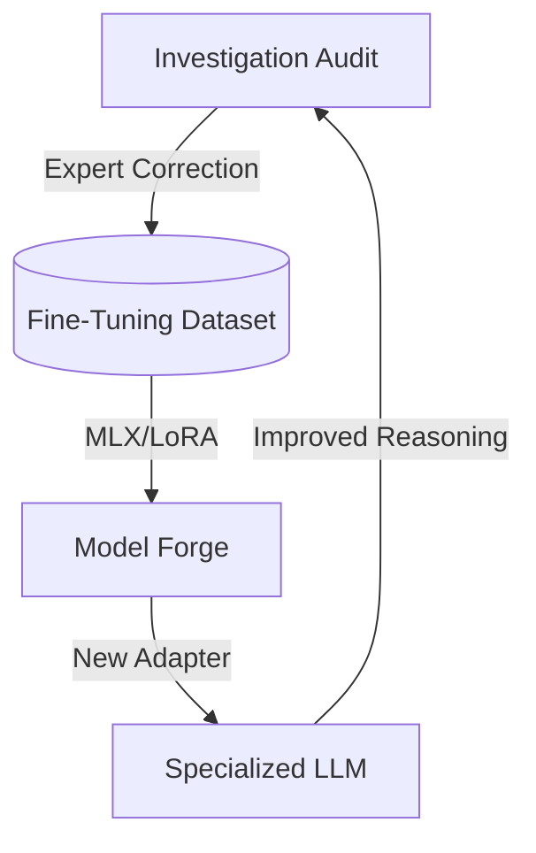

# 06. Machine Learning & LLM Forge

Sentinel bridges the gap between traditional statistical modeling and modern generative AI by offering a unified workflow for both Scikit-learn models and LLM fine-tuning.

## 🧪 1. Traditional ML Workflow

The system uses an **Auto-ML Pipeline** to transform raw transaction tables into predictive models:

1.  **Feature Discovery**: The `build_training_dataset` utility automatically identifies numeric, categorical, and temporal features.
2.  **Model Selection**: Sentinel benchmarks multiple algorithms during the "Auto-Train" phase:
    - **Random Forest**: Best for non-linear relationships.
    - **XGBoost**: Optimized for imbalanced fraud datasets.
    - **Logistic Regression**: Baseline for explainable scoring.
3.  **Threshold Tuning**: A dynamic calibration step allows investigators to adjust the cutoff to balance Precision vs. Recall.
4.  **SHAP Interpretability**: Global and local feature importances are calculated to provide human-readable explanations for every model decision.

## 🧬 2. LLM Forge (Fine-Tuning Architecture)

For advanced reasoning, Sentinel enables LoRA-based fine-tuning:

- **LoRA (Low-Rank Adaptation)**: Instead of training all billions of parameters, the system trains a small "adapter" layer (approx. 1-2% of model size) that specializes the LLM for fraud terminology.
- **Training Data**: Generated from "Expert Feedback" collected in the UI. When an investigator corrects an AI report, the **Input (Data) + Output (Correction)** pair is saved as a training sample.
- **Local Deployment**: Fine-tuned models are hosted via **Ollama** or **MLX**, ensuring data privacy by keeping the weights and inference inside the organization's network.

## 📈 3. Feedback Loop

> [!IMPORTANT]
> The **Model Registry** keeps track of which version of a model (ML or LLM) was used for every investigative report to ensure forensic reproducibility.
